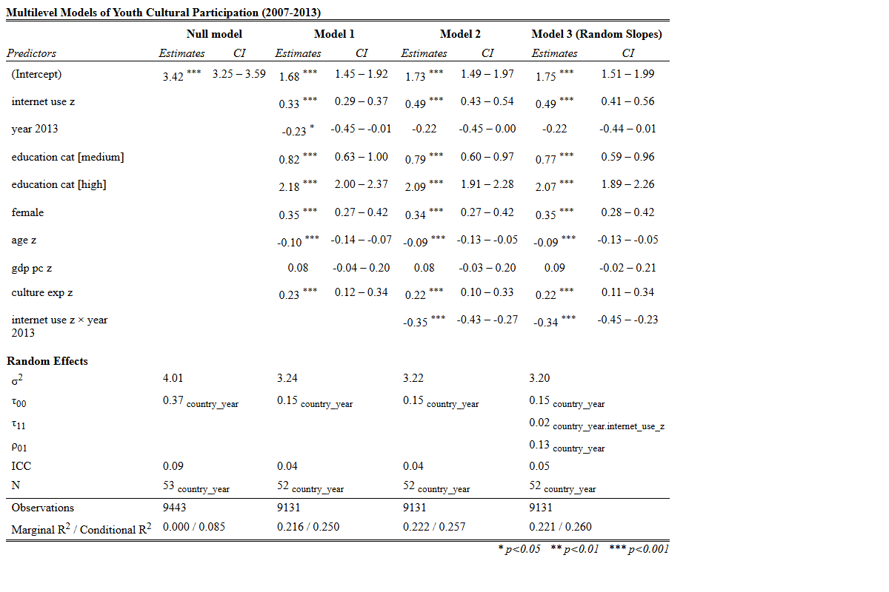
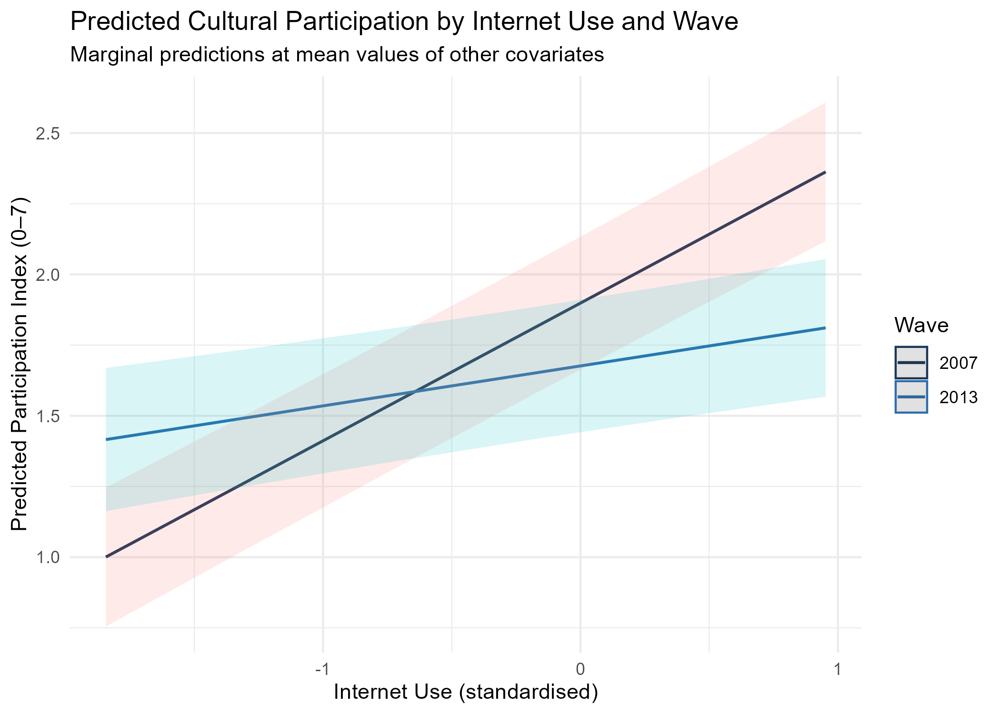
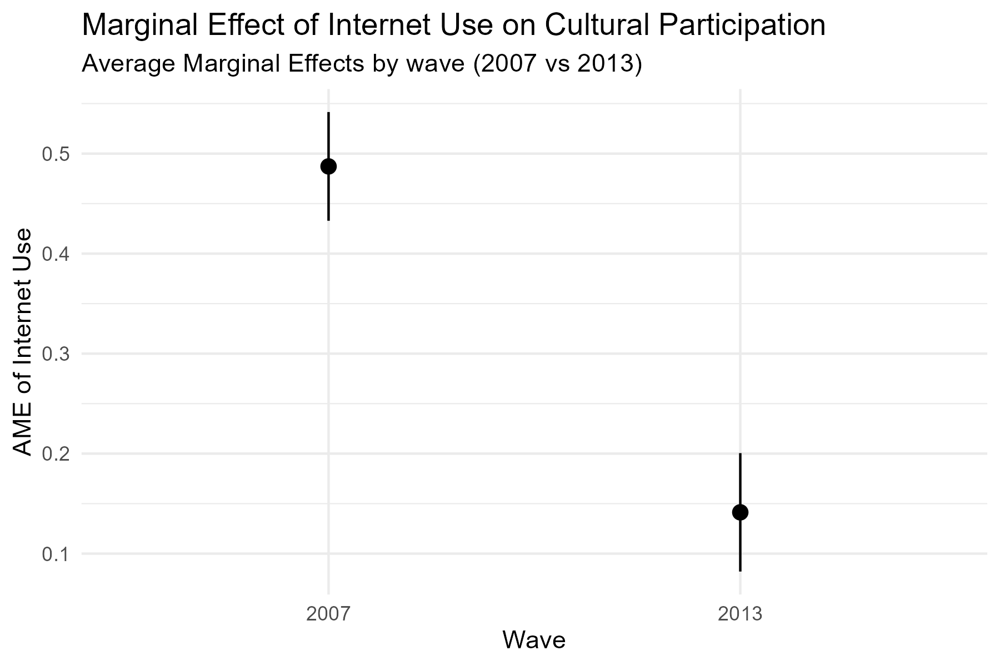
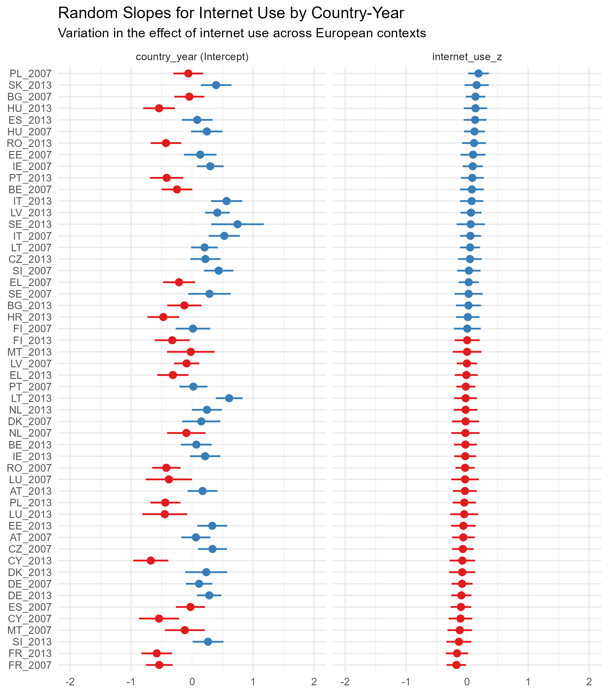
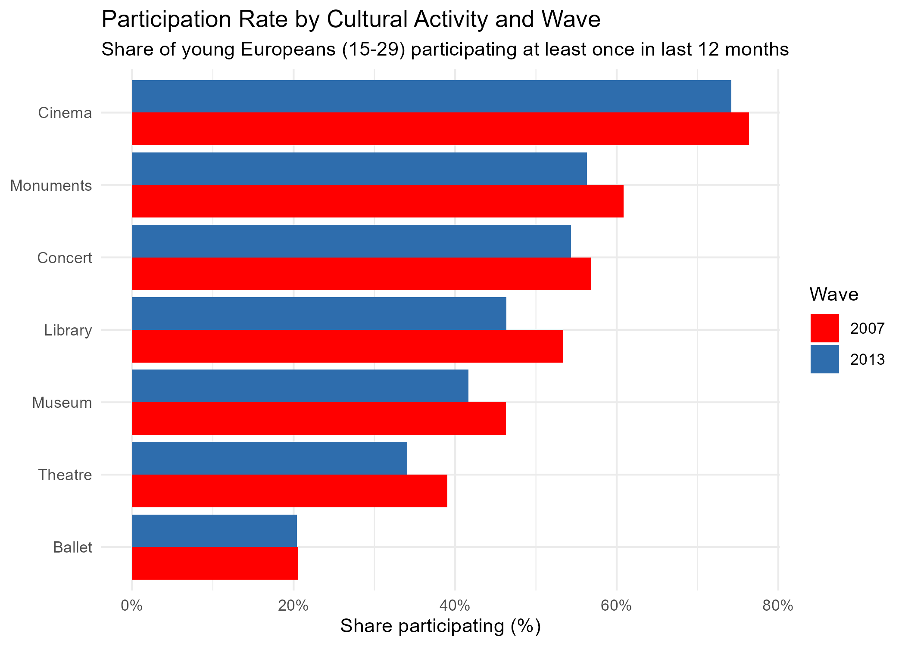

```{r}
#| label: Load data
#| echo: false
#| message: false
#| warning: false

library(tidyverse)
library(lme4) 
library(sjPlot)
library(marginaleffects)

#Load data
df_final <- read_csv("../data/processed/main_dataset.csv",
                     show_col_types = FALSE)
# Prepare variables
#Create year_country variable because gdp_pc and culture_exp change in the country between 2007 and 2013

df_final <- df_final %>%
  filter(!is.na(country), !is.na(year), !is.na(part_index)) %>%
  mutate(
    country_year = factor(str_c(country, "_", year)),
    country = factor(country),
 # education_cat as factor with "low" as reference category     
    education_cat = factor(education_cat,
                           levels = c("low", "medium", "high")),
    country = factor(country),
 year_2013 = as.numeric(year == 2013)
 
)
# Macro statistics: standardise the country variables using mean and sd at the country level
macro_stats <- df_final %>%
  group_by(country_year) %>%
  summarise(
    gdp_raw = mean(gdp_pc, na.rm = TRUE),
    culture_raw = mean(culture_exp, na.rm = TRUE),
    .groups = "drop"
  ) %>%
  filter(!is.na(gdp_raw), !is.na(culture_raw)) %>%
  summarise(
    mean_gdp  = mean(gdp_raw, na.rm = TRUE), 
    sd_gdp    = sd(gdp_raw, na.rm = TRUE),
    mean_cult = mean(culture_raw, na.rm = TRUE), 
    sd_cult   = sd(culture_raw, na.rm = TRUE)
  )

    # Standardise continuous predictors (x - mean(x)) / sd(x) → mean = 0, sd = 1
df_final <- df_final %>%
  mutate(   
  #For individual predictor we calculate the on all the dataset,
  #for country-level predictors we use the means at macro level
 internet_use_z = (internet_use_rev - mean(internet_use_rev, na.rm = TRUE)) /
      sd(internet_use_rev, na.rm = TRUE),
 age_z= (age - mean(age, na.rm = TRUE)) / sd(age, na.rm = TRUE),
   gdp_pc_z= (gdp_pc - macro_stats$mean_gdp) / macro_stats$sd_gdp,
 culture_exp_z= (culture_exp - macro_stats$mean_cult) / macro_stats$sd_cult
  )
# Load saved models
model0 <- readRDS("../tables/model0.rds")
model1 <- readRDS("../tables/model1.rds")
model2 <- readRDS("../tables/model2.rds")
model3 <- readRDS("../tables/model3.rds")
```

Cultural participation is a right enshrined in the United Nations Declaration of Human Rights, a key element for the quality of individual and collective life, able to generate positive effects on individual opportunities, quality of life and wellness as a whole. Its study should take into account a broad spectrum of cultural activities and analyse how both individual characteristics and social and contextual features affect it.

## Research question and hypotheses

The research aims to understand to what extent do individual-level factors (internet use for cultural purposes, education, socioeconomic status) and country-level factors (GDP per capita, government expenditure on culture) explain participation in cultural activities among young Europeans (15–29 years old) and how did this relationship change between 2007 and 2013.

The main hypotheses are the following:

1.  Individual internet use is associated with physical cultural participation among young Europeans, net of educational attainment and employment status. The direction of the effect (positive = complement; negative = substitute) is determined empirically;

2.  The association between internet use and cultural participation changed between 2007 and 2013, when social media and digital platforms developed.

3.  Young people living in countries with higher GDP per capita show higher cultural participation rates, independently of individual-level socioeconomic characteristics;

4.  Young people living in countries with higher government expenditure on culture show higher participation rates independently of national wealth.

The central theoretical point focuses on digitalization and its relationship with cultural participation, to understand whether digital culture replaces physical cultural attendance and/or complements it.

## Data and variable operationalization

Data come from two Special Eurobarometers: Eurobarometer 278 “European cultural values” and Eurobarometer 399 “Cultural Access and Participation”, two surveys conducted by the European Commission in 2007 and 2013, in which around 27,000 European citizens were interviewed face-to-face in their homes across all 27 EU countries. Each interviewed answered questions about its cultural participation.

Data were pooled into a single cross-sectional dataset of 9,131 young Europeans aged 15–29 across 27 countries, so, the unit of analysis, is the individual, nested within country-years.

The dependent variable is an index of cultural participation (0–7), counting the number of activities attended at least once in the last 12 months (cinema, theatre, concert, museum, monuments, library, ballet). As shown in Figure 1, the index follows an approximately symmetric, bell-shaped distribution (mean = 3.41, median = 3), with only 10% scoring zero, supporting the use of a linear multilevel model.

```{r}
#| echo: false
#| label: fig-distribution
#| fig-cap: "Distribution of the Cultural Participation Index"

# Histogram of the Distribution of the Dependent Variable: participation index
ggplot(df_final, aes(x = part_index)) +
  geom_histogram(bins = 8, fill = "cyan3", color = "white") +
  geom_vline(aes(xintercept = mean(part_index, na.rm = TRUE)),
             color = "darkblue", linetype = "dashed", linewidth = 0.8) +
  geom_vline(aes(xintercept = median(part_index, na.rm = TRUE)),
             color = "gray28", linetype = "dotted", linewidth = 0.8) +
  annotate("text", x = mean(df_final$part_index, na.rm = TRUE) + 0.2,
           y = 1450, label = "Mean = 3.41", color = "darkblue", size = 3.5, hjust = 0) +
  annotate("text", x = median(df_final$part_index, na.rm = TRUE) - 0.2,
           y = 1350, label = "Median = 3", color = "gray28", size = 3.5, hjust = 1) +
  theme_minimal() +
  labs(title = "Distribution of the Cultural Participation Index",
       x = "Number of activities (0-7)", y = "Count")

```

The main independent variable is internet use for cultural purposes. A key limitation is that this variable is operationalised differently across waves: in 2007 it measures general internet use frequency, while in 2013 it captures specifically cultural internet use, introducing partial non-comparability. Country-level predictors include GDP per capita PPS and government expenditure on culture (% GDP), both from Eurostat (2007 and 2013). Control variables include educational attainment (age when stopped full-time education, recoded into three categories: low/medium/high), employment status, sex, and a year dummy (2007/2013).

All continuous predictors are standardised (z-scores), country-level variables are centred at their cross-country mean to improve interpretability of the intercept.

## Model choice and statistical justification

The nested structure of the data, individuals within country-years, requires a multilevel model, with random intercepts by country-year. The model allows baseline participation rates to vary across European contexts while estimating fixed effects for both individual- and country-level predictors.

Given the distributional properties of the outcome described in the previous paragraph, a linear multilevel model is preferred over a multilevel Poisson or negative binomial model.

Four models are estimated sequentially:

**Model 0** is a null model with random intercepts only and no predictors, used to compute the Intraclass Correlation Coefficient (ICC) and assess the degree of country-year clustering.

$$part\_index_{ij} = \beta_0 + u_j + e_{ij}$$ {#eq-model0}

**Model 1** is the multilevel base model, it introduces all fixed-effect predictors (internet use, education, sex, age, year dummy, GDP per capita and government expenditure on culture) with a random intercept by country-year. This model tests Hypotheses 1, 3, and 4.

$$\begin{aligned}
part\_index_{ij} = \, & \beta_0 + \beta_1(internet\_use_{ij}) + \beta_2(year_{ij}) + \\
& \beta_3(education_{ij}) + \beta_4(female_{ij}) + \beta_5(age_{ij}) + \\
& \gamma_1(GDP_j) + \gamma_2(Culture\_Exp_j) + u_j + e_{ij}
\end{aligned}$$ {#eq-model1}

**Model 2** extends Model 1 by adding an interaction term between internet use and the year dummy (internet_use_z \* year_2013), directly testing Hypothesis 2, whether the association between internet use and physical cultural participation changed between 2007 and 2013.

$$\begin{aligned}
part\_index_{ij} = \, & \beta_0 + \beta_1(internet\_use_{ij}) + \beta_2(year_{ij}) + \\
& \beta_3(internet\_use_{ij} \times year_{ij}) + \beta_4(education_{ij}) + \\
& \beta_5(female_{ij}) + \beta_6(age_{ij}) + \\
& \gamma_1(GDP_j) + \gamma_2(Culture\_Exp_j) + u_j + e_{ij}
\end{aligned}$$ {#eq-model2}

**Model 3** further extends Model 2 by allowing the slope of internet use to vary across country-years, testing whether the internet effect is homogeneous across European societies.

$$\begin{aligned}
part\_index_{ij} = \, & \beta_0 + \beta_1(internet\_use_{ij}) + \beta_2(year_{ij}) + \\
& \beta_3(internet\_use_{ij} \times year_{ij}) + \beta_4(education_{ij}) + \\
& \beta_5(female_{ij}) + \beta_6(age_{ij}) + \\
& \gamma_1(GDP_j) + \gamma_2(Culture\_Exp_j) + \\
& u_j + u_{1j}(internet\_use_{ij}) + e_{ij}
\end{aligned}$$ {#eq-model3}

## Results

Table 1 presents the results of the four multilevel models estimating youth cultural participation. Model 1 includes all predictors as main effects, Model 2 adds the interaction term between internet use and the year dummy, Model 3 extends Model 2 by allowing the slope of internet use to vary across country-years. The null model (Model 0) serves as baseline to compute the Intraclass Correlation Coefficient (ICC).

```{r}
#| echo: false
#| message: false
#| warning: false
#| label: regression table

```

The null model yields an ICC of 0.09, indicating that 9% of the total variance in cultural participation is explained by the differences between country-years, while the remaining 91% indicates that the individual part (internet use, education, employment) is the most important. Although it is slightly below the conventional threshold of 0.10, a multilevel model remains necessary because the research design includes country-level predictors (GDP per capita and government expenditure on culture) that cannot be correctly estimated in a single-level OLS model. Furthermore, the random intercepts capture systematic baseline differences in cultural participation across European contexts that are meaningful.

**Individual-level predictors.** Across both models, educational attainment is the strongest predictor of cultural participation. Compared to individuals with low education (reference category), those with medium education participate in approximately 0.82 more activities (Model 1: b = 0.82, CI: 0.63–1.00, p\<0.001), while those with high education participate in approximately 2.18 more activities (Model 1: b = 2.18, CI: 2.00–2.37, p\<0.001). Internet use is positively associated with participation in both models. In Model 1, a one standard deviation increase in internet use is associated with 0.33 additional cultural activities (CI: 0.29–0.37, p\<0.001). Being female is associated with approximately 0.35 more activities than males. Age, standardized within the 15–29 range, is negatively associated with participation (b = -0.10, p\<0.001), indicating that younger respondents within the range participate slightly more.

**Country-level predictors.** GDP per capita is not significantly associated with participation in either model (Model 1: b = 0.08, p = 0.191; Model 2: b = 0.08, p = 0.164). Government expenditure on culture, however, is positively and significantly associated with participation (Model 1: b = 0.23, CI: 0.12–0.34, p\<0.001; Model 2: b = 0.22, CI: 0.10–0.33, p\<0.001), suggesting that institutional investment in cultural infrastructure is associated with higher youth participation, independently of national wealth.

**Interaction term (Model 2).** The interaction between internet use and year (internet use \* year 2013) is negative and significant (b = -0.35, CI: -0.43 – -0.27, p\<0.001). In 2007, a one standard deviation increase in internet use is associated with 0.49 additional cultural activities. By 2013, this effect is reduced to approximately 0.14 (0.49 + (-0.35)), indicating that the association between internet use and physical cultural participation weakened over the period. The year 2013 main effect is negative but marginally non-significant in Model 2 (b = -0.22, p = 0.054).

Figure 2 visualizes the interaction between internet use and wave, showing two lines with different slopes: the 2007 line is steeper, reflecting the stronger complementary effect of internet use in that period.

```{r}
#| echo: false
#| label: fig-interaction
#| fig-cap: "Predicted Cultural Participation by Internet Use and Wave"


```

Figure 3 presents the Average Marginal Effects (AMEs) of internet use by wave. The AME in 2007 is 0.487 compared to 0.141 in 2013, a reduction of approximately 71%. The non-overlapping confidence intervals confirm that the difference between waves is statistically significant. 

```{r}
#| echo: false
#| label: fig-ame
#| fig-cap: "Marginal Effect of Internet Use on Cultural Participation"


```

**Random slopes (Model 3).** The variance of the random slopes for internet use is close to 0 ($\tau_{11}$ = 0.02), suggesting that the association between internet use and cultural participation is relatively stable across European country-years. Fixed effect estimates are virtually unchanged from Model 2, confirming robustness. Figure 4 displays the country-year random effects from Model 3. While baseline participation rates vary substantially across European contexts (left panel), with Nordic and Western European countries which tend to have positive intercepts (higher baseline participation) and Eastern European countries which have negative intercepts (lower baseline), the slopes for internet use show less variation (right panel), with most country-year deviations clustering near zero. This confirms that the association between internet use and cultural participation is relatively homogeneous across European societies.

```{r}
#| echo: false
#| label: fig-randomslopes
#| fig-cap: "Random slopes for Internet use by country-year "



```

The variance of the random intercepts ($\tau_{00}$) decreases substantially from 0.37 in the null model to 0.15 in Models 1–3, indicating that the individual- and country-level predictors explain a large share of the baseline differences in participation between country-years. The residual variance ($\sigma^2$), the variability in the residuals that is not explained by the model, similarly decreases from 4.01 to 3.22 as predictors are added, reflecting improved model fit.

Figure 5 disaggregates participation by activity type and wave. Cinema remains the most common activity (75%) but shows a modest decline between 2007 and 2013. The sharpest declines are observed for library visits, theatre attendance and museum visits while ballet attendance is stable. These patterns suggest that the aggregate decline in participation masks heterogeneity across activity types, with different substitution effects across them.

```{r}
#| echo: false
#| label: fig-activitiesdisaggregated
#| fig-cap: "Participation Rate by Cultural Activity and Wave"


```

## Interpretation and substantive insights

From the results the following insights and conclusions can be drawn:

Internet use complements rather than substituting physical cultural participation, but less over time. In 2007, higher internet use was associated with attending more cultural activities in person, consistent with the hypothesis that the internet can complement rather than replace offline participation. By 2013, this effect weakened significantly, a reduction of approximately 71%. This change can be related to the mass diffusion of social media platforms and streaming apps between the two waves. However, this finding must be interpreted with caution: the internet use variable is operationalised differently across waves, as already mentioned. This difference in measure may contribute to the weakening of the effect, as the 2013 variable already involves culturally engaged users, reducing the association. The conclusion that internet use was more strongly complementary to physical cultural participation in 2007 than in 2013 is plausible, but the change is strongly related to the different variable operationalisation.

The most powerful predictor in all models is educational attainment. Highly educated young Europeans participate in around two more cultural activities than their low-educated peers, net of all other factors (b = 2.18, p\<0.001). This finding is consistent with Bocci and Mingo (2023), who documented persistent educational gradients in cultural participation across Europe. Digitalisation has not interrupted the fundamental socioeconomic structure of cultural access among youth.

Government expenditure on culture shows a positive association with participation across all models, while GDP per capita shows no significant effect. However, these country-level estimates should be interpreted with caution: with only 27 country-years at level 2, coefficients for country-level predictors are unstable and with wide uncertainty intervals, as reflected in the confidence intervals for GDP per capita, which cross zero in all models. Rather than drawing strong conclusions, these patterns suggest that institutional investment in cultural infrastructure may matter over and above national wealth, an hypothesis that should be better tested by further investigation with a larger sample. However, the non-significance of GDP per capita does not exclude an economic gradient in cultural participation.

## Limitations and reflection

Several limitations should be taken into account when interpreting these findings.

The main independent variable, internet use, is measured differently in the two waves, introducing partial non-comparability that affects the estimated change between waves. The observed weakening of the internet effect between 2007 and 2013 should therefore be interpreted cautiously because part of the change may reflect the measurement differences.

The cross-sectional design within each wave cannot establish causal direction. Individuals who are already culturally engaged may use the internet more for cultural purposes as a consequence of their participation rather than as a cause. Furthermore, internet use for cultural purposes may itself proxy latent cultural interest; someone searching for museum exhibitions online is already culturally disposed. This does not invalidate the analysis but changes its interpretation.

Country-level units are limited: with only 27 countries at level 2, country-level coefficient estimates are unstable and highly uncertain. GDP per capita and government cultural expenditure should not be interpreted as precise causal estimates. These patterns should be treated as hypotheses for future research with larger comparative samples.

The dependent variable combines seven culturally distinct activities. As shown in Figure 5, different activities show different trends between waves. Internet use may complement some activities while substituting others. Future research should model activity-specific outcomes to capture this heterogeneity.

## Bibliography

Bocci, Laura, and Isabella Mingo. ‘*Cultural Participation and Social Inequality in the Digital Age: A Multilevel Cross-National Analysis in Europe*’. In *Models for Data Analysis*, vol. 402, edited by Eugenio Brentari, Marcello Chiodi, and Ernst-Jan Camiel Wit. Springer Proceedings in Mathematics & Statistics. Springer International Publishing, 2023.<https://doi.org/10.1007/978-3-031-15885-8_6>.

Cvetičanin, Predrag, Lucas Page Pereira, Mirko Petrić, Inga Tomić-Koludrović, Frédéric Lebaron, and Željka Zdravković. ‘*Cultural Practices and Socio-Digital Inequalities in Europe: Towards a Unified Research Framework in Cultural Participation Studies*’. *Cultural Sociology 19*, no. 3 (2025): 326–49.<https://doi.org/10.1177/17499755231222520>.

Janssen, Susanne,  Kristensen Nete Nørgaard, Verboord Marc, Marquart Franziska, Lamberti Giuseppe. ‘*Europeans’ Digital Cultural Participation: Diversification, Democratization, Barriers, and Affordances*’. *International Journal of Communication*, 18, (2024): 4031–4096. [link.gale.com/apps/doc/A812519102/AONE?u=milano&sid=bookmark-AONE&xid=125bf3a7](http://link.gale.com/apps/doc/A812519102/AONE?u=milano&sid=bookmark-AONE&xid=125bf3a7)

## AI disclosure

This analysis was conducted with assistance from Claude (Anthropic), an AI language model, used throughout the research process.

The datasets, research topic and hypotheses were autonomously chosen and then AI was used to brainstorm the research question and understand whether the chosen statistical models were appropriate.

Claude provided assistance in understanding how the datasets were structured, writing and debugging R code for data import and data cleaning, especially with the Eurobarometer datasets since they were large and the variables operationalised and identified in different ways. To debug Claude was used by sending the errors that came up and it suggested where there was an error.

Finally, AI was used to check the results and their interpretation. 
